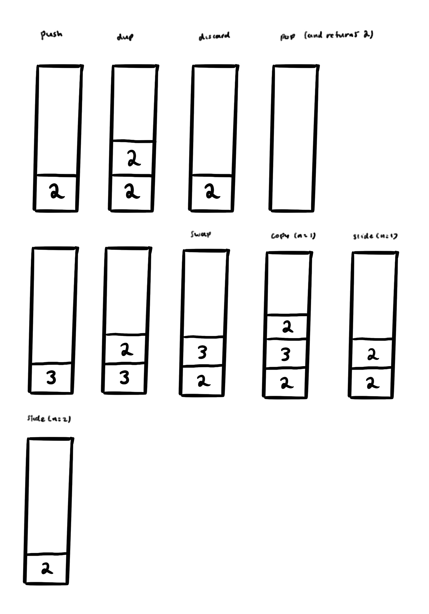
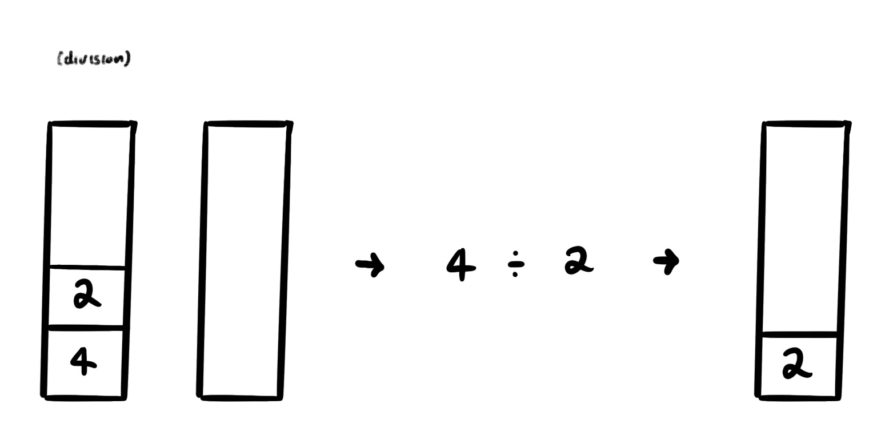
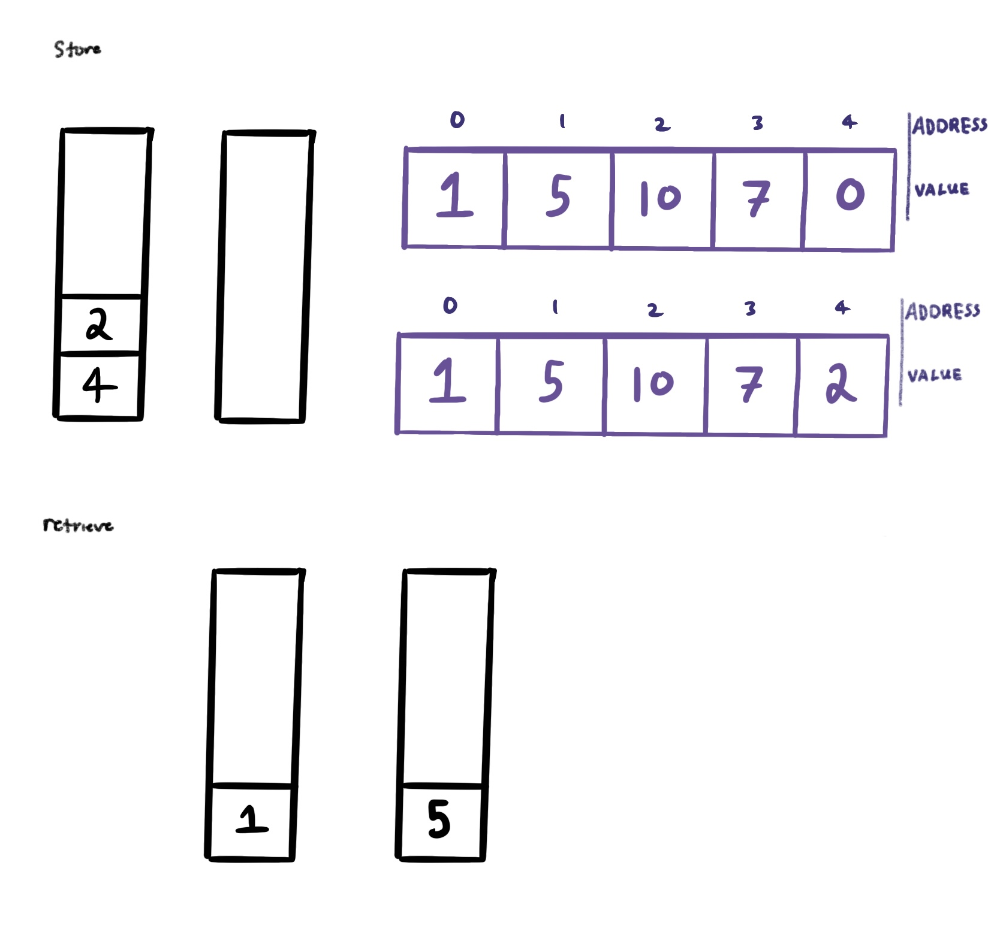
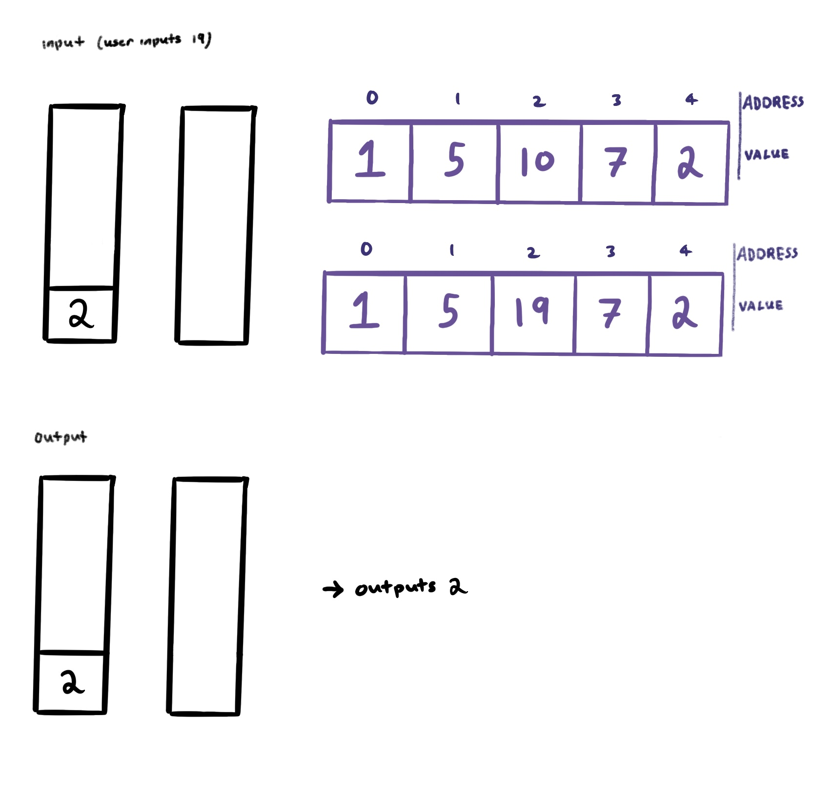

# Whitespace Interpreter

**What is an esoteric language?**:

An esoteric programming language is an experimental programming language written for reasons other than its practicality. Often, esoteric languages (or esolangs) are written as a joke, to test the capabilities of a programmer, to play with new ideas, or to try obfuscation (making it as hard to read as possible).

**What is Whitespace?**:

***Whitespace*** is an esoteric language written by Edwin Brady and Chris Morris in 2003. In a strange diversion from typical programming, Whitespace coding only uses spaces, tabs, and new lines -- all other characters are completely ignored. For our project, we coded an interpreter that can do two things:

1) Translate Whitespace to plain text and print out the result
2) Translate a command written in Whitespace and execute it directly

In order for this to work, we first needed to understand how Whitespace functions. There are three important values that Whitespace uses

- ASCII value 32 represents a space
- ASCII value 9 represents a tab
- ASCII value 10 represents *line feed*, or a new line.

Our interpreter is ran with one command in the terminal: make whitespace. The option added determines the outcome:

Printing the Whitespace from a file in plain text:
>make whitespace ARGS="-p [FILE NAME]'

Executing the Whitespace code from a file:
>make whitespace ARGS="-r [FILE NAME]'

Once we reviewed a few color-coded examples of Whitespace code, we dove into understanding Instruction Modification Parameters, or IMP. IMP is not a commonly used term, but it is used in documentation written for Whitespace (although official, original documentation has been unpublished since its creation). IMP refers to the beginning of a command, used to designate its purpose when interpreting code. For Whitespace, there are five different IMPs for five different categories of commands: 
1. Stack manipulation
2. Arithmetic
3. Heap access
4. Flow control
5. Input/output (I/O)

### Stack Manipulation

For stack manipulation, the IMP at the beginning of each command is just a [SPACE]. Stack manipulation commands are used to modify the stack---pushing items, duplicating items, swapping items, discarding items, etc.

operator | parameter | command
--- | --- | ---
[SPACE] | number | **push**
[LF][SPACE] |  | **duplicate**
[LF][LF] |  | **discard**
[LF][TAB] | | **swap**
[TAB][SPACE] | number | **copy**
[TAB][LF] | number | **slide**

\* *pop is not a command that can be called by the user, but it is used in other commands*

### Arithmetic

For arithmetic, the IMP at the beginning of each command is [TAB][SPACE]. Whitespace handles simple arithmetic, including addition, subtraction, multiplication, integer division, and modulo. The numbers used for these commands come from the stack in the order *second value popped* [operation] *first value popped*.

operator | parameter | command
--- | --- | ---
[SPACE][SPACE] |  | **additon**
[SPACE][TAB] |  | **subtraction**
[SPACE][LF] |  | **multiplication**
[TAB][SPACE] |  | **division**
[TAB][TAB] |  | **modulo**

### Heap Access

For heap access, the IMP at the beginning of each command is [TAB][TAB]. There are only two commands for heaps: storing a value in a heap and retrieving a value from a heap. When storing a value in the heap, the value and address is popped from the stack. When retrieving a value from the heap, an address is popped from the stack and the corresponding value from the heap is pushed to the stack. 

operator | parameter | command
--- | --- | ---
[SPACE] |  | **store**
[TAB] |  | **retrieve**

### Flow Control

For flow control, the IMP at the beginning of each command is [LINEFEED]. Flow control, essentially, is regulating data flow in order to prevent overwhelming the receiver (what is the receiver?? regulate how??). Somebody explain this......

[show examples and explain the commands specifically]

operator | parameter | command
--- | --- | ---
[SPACE][SPACE] | label | **mark a location in program**
[SPACE][TAB] | label | **call a subroutine**
[SPACE][LF] | label | **jump unconditionally to a label**
[TAB][SPACE] | label | **jump to a label if the top of the stack is zero**
[TAB][TAB] | label | **jump to label if the top of stack is negative**
[TAB][LF] |  | **end subroutine & transfer control back to caller**
[LF][LF] |  | **end program**

### Input/Output

Finally, for input/output, the IMP at the beginning of each command is [TAB][LINEFEED]. Input/output commands pop a value from a stack and performs an action with it, whether it be using it as an address for a user inputted value or as the value to be outputted.

operator | parameter | command
--- | --- | ---
[TAB][SPACE] |  | **input ascii character**
[TAB][TAB] |  | **input number**
[SPACE][SPACE] |  | **output ascii character**
[SPACE][TAB] |  | **output number**

 

how numbers work... should that be moved up as well
